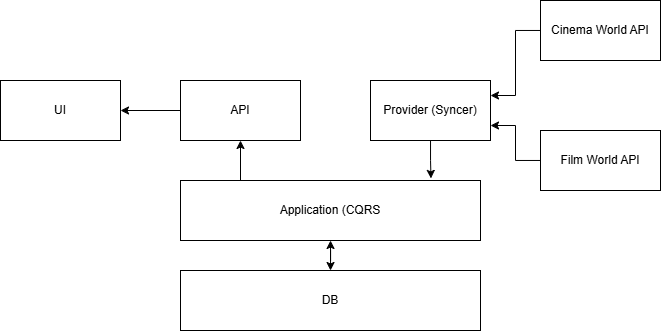

# MovieStore

This repository provides a solution for the WebJet Movie Store.

## Required Software

- Nodejs (node-v22.14.0-x64)
- .NET Core (.NET 9.0 SDK)

## Run Application

```sh
# Step 1: Clone Repo
git clone https://github.com/praneethw/webjet-movie-store.git

# Step 2: Navigate to clone location (e.g. C:\projects\webjet-movie-store)
cd C:\projects\webjet-movie-store

# Step 3: Inatall NPM
npm i -g npx

# Step 4: Install NX
npm add -g nx@latest

# Step 5: run npm install
npm install

# Run application
nx run-many -t serve -p ui api
```

The applications can be accessed via the following URLs,

- UI - `http://localhost:4200/`
- API - `http://localhost:4200/api/swagger/index.html`


## Solution Design
The solution has been designed using the clean architecture guidelines with a combination of CQRS pattern. For simplicituy the layeras of the clean architecture have not been split into multiple project, but combined within a single api project.



The design follows a provider aggregator pattern, where a synchronisation service will pull, sanitize, and conform data to a consistent domain model. The domain model is accessed by the UI for display and querying.

### Key benefits

- Ability to add more providers over time, with varying api structures and data models.
- Domain model is consistent and can evolve seporately due to decoupling of provider / product
- Provider down time does not impact the application, and the application can serve requests without waiting to query provider APIs in real time.

## Improvments and Next steps

- Some providers, provide broken poster links this can be fixed by requerying a service such as the `https://www.themoviedb.org/` and fix broken links
